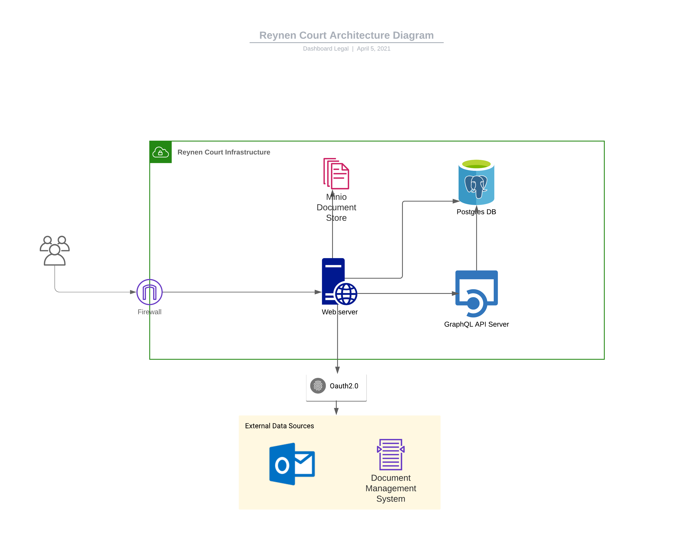

Besides the multi-tenant & private-tenant deployments that Dashboard Legal provides in its own cloud infrastructure, customers can choose to deploy our technology in their own on-premise hosted infrastructure.

This is done through a partner called [Reynen Court](https://reynencourt.com). For those new to Reynen Court, think of it like an app store for legal technology. Both Dashboard Legal and its customers integrate with the Reynen Court platform, which enables Dashboard Legal to release new versions of its technology for customers to deploy on their own infrastructure, either on-premises or in their virtual private cloud.

To learn more about Reynen Court, please read about the [platform](https://reynencourt.com/platform), [benefits](https://reynencourt.com/benefits), and [company](https://reynencourt.com/about) on their website.

## About Reynen Court Deployments
- Dashboard Legal deploys a Kubernetes Helm chart to the Reynen Court (RC) platform.
- After security testing & smoke testing, it becomes available to customers.
- Customers host their own deployments of each application version, which the Dashboard Legal team does not have access to.
- Dashboard Legal does provide support for RC-deployed applications, but requires collaboration from the customer's IT staff to debug any issues post-deployment.
- Dashboard Legal application functionality relies on third-party [email integrations](../email/intro/#currently-supported-integrations) and [document integrations](../documents/intro/#currently-supported-integrations), which are not deployed as part of the Dashboard Legal stack, and thus still need to be integrated. These integrations could be cloud-based, or also deployed on-premise in some cases.

## Deployment Guide

Once you have signed up for Reynen Court and have downloaded the most recent Dashboard Legal application version, please use the following guide for deploying the Dashboard Legal application.

### On-prem Architecture Diagram

### RCspec File
The following application configuration options are required/available.

Please note that the azure key/secret are required to use the [o365 Outlook Integration](../email/intro/#currently-supported-integrations).

The SMTP credentials are used only for certain application-initiated emails like password reset. The user emails will be managed by the selected email integration provider. It is recommended to include SMTP credentials for the environment if your users are logging in with username/password.

| Variable      | Required | Description |
| ------------- | -------- | ------------|
| num_app_replicas | Yes | The number of application pods to launch. |
| database_size_gb | Yes | The number of gigabytes to reserve for database storage. |
| database_backups_size_gb | Yes | The number of gigabytes to reserve for database backups. |
| file_storage_size_gb | Yes | The number of gigabytes to reserve for files. |
| azuread_oauth2_key | No | Azure AD OAuth2.0 Key. Required for Outlook integration. |
| azuread_oauth2_secret | No | Azure AD OAuth2.0 Secret. Required for Outlook integration. |
| smtp_host | No | SMTP Host. Required to send emails such as password reset. |
| smtp_port | No | SMTP Port |
| smtp_username | No | SMTP User |
| smtp_password | No | SMTP Password |
| smtp_use_tls | No | Use TLS over SSL for SMTP connection |
| imanage_oauth_key | No | iManage Oauth2.0 Key. Required for iManage integration |
| imanage_oauth_secret | No | iManage Oauth2.0 Secret. Required for iManage integration |
| exchange_encryption_key | No | Fernet cryptography key used for securely storing Exchange integration credentials. Generate one online at https://8gwifi.org/fernet.jsp and keep it a secret. Required for Exchange integration |
| debug_mode | No | Set to Yes for admin debuging capabilities |

### Network Connectivity

Please ensure the following hosts/ports are open in your firewall for external connections

| Host      | Port(s) | Reason |
| ------------- | -------- | ------------|
| outlook.office365.com  | 443 | If using o365 integration |
| login.microsoftonline.com  | 443 | If using o365 integration |
| graph.microsoft.com  | 443 | If using o365 integration |
| cloudimanage.com  | 443 | If using cloud iManage integration |
| YOUR-EXCHANGE-SERVER-HOST | 80, 443 | If using on-prem Exchange integration |
| YOUR-IMANAGE-SERVER-HOST | 80, 443 | If using on-prem Imanage integration |
| YOUR-SMTP-SERVER-HOST | 25, 465, 587 | SMTP Server for invite & forgot-password emails |

### Creating the Organization
The customer IT admin should sign up at "/accounts/signup/" on the host that is created on the RC platform. After signing up, they can then manage the organization [security settings](./security-settings) and [invite other users](./managing-users).

### Configuring Integrations
To set up SSO, please follow [this guide](./security-settings/#single-sign-on). Please keep in mind that invited users should visit the organization-specific login/register page to sign in with SSO.

If you are using the o365 Outlook email integration, there is no additional configuration necessary. Invited users will log in via oauth2 to link their email account.

The default document integration is set to Dashboard Legal. For on-premise deployments, the documents are stored on-premise using a Minio container. To set up an iManage DMS integration, please follow [this guide](../documents/imanage). The decision to use Dashboard Legal's DMS on your own servers or connecting a third-party DMS will have implications on infrastructure size requirements.

## Infrastructure Sizing 

When deploying the Dashboard Legal application on your own infrastructure, please allocate the following recommended infrastructure sizes, based on your organization size.

Please keep in mind that the Minio container stores certain images used in the application (like user avatars), and documents if you are using the DBL in-house DMS. There will always be a need for some storage space (for the avatars), but if you are using the DBL DMS you will need to size it based on your intended document use.

| Deployment    |   | Resource | Requirement |
| ----------    | - | -------- | ----------- |
| Small (1 - 20 users)     |   | vCPU   | 1                           |
|                          |   | Memory | Web 1GB, Hasura 1GB         |
|                          |   | Disc   | Postgres 8GB, Minio 4GB\*   |
| Medium (20 - 50 users)   |   | vCPU   | 2                           |
|                          |   | Memory | Web 2GB, Hasura 2GB         |
|                          |   | Disc   | Postgres 16GB, Minio 8GB\*  |
| Large (50+ users)        |   | vCPU   | 4                           |
|                          |   | Memory | Web 4GB, Hasura 4GB         |
|                          |   | Disc   | Postgres 64GB, Minio 16GB\* |

**\* If using the DBL DMS, add estimated size of documents stored**

