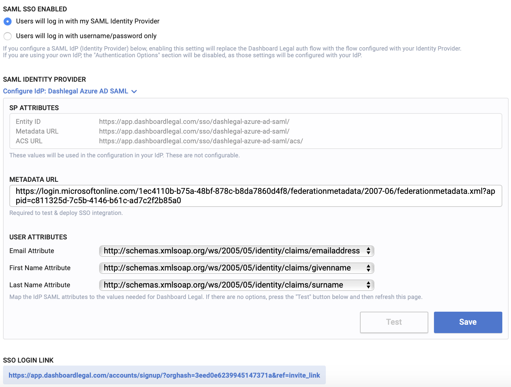
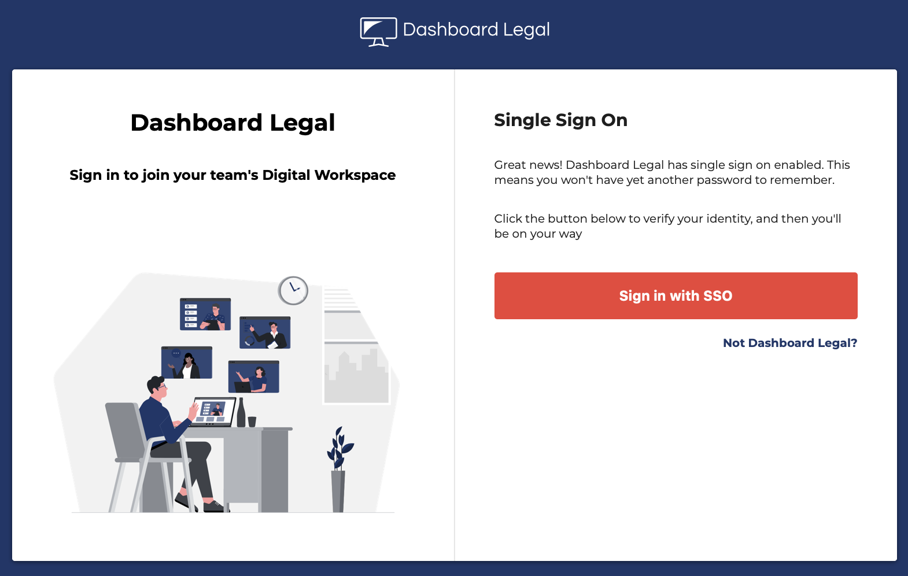
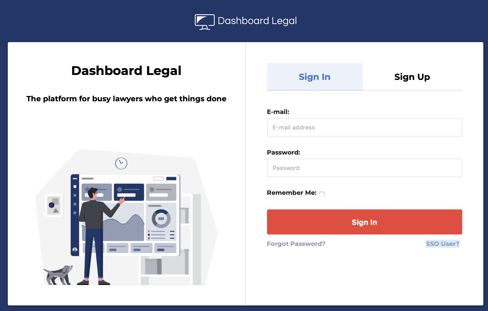

Organization Owners and Admins can manage the security settings for their organization in the [security settings page](https://app.dashboardlegal.com/x/settings/security/).

> To learn mobe about the difference between Owners, Admins, and Members, please read the [User Roles](../administration/managing-users/#user-roles) guide.

## Multi-Factor Authentication
MFA is a security feature which ensures the user's identity by requiring them to not just enter their username/password combination, but also verify with a one-time password via their mobile device every time they log in.

Any user can set up MFA on their own account by visiting their [account security page](https://app.dashboardlegal.com/x/account/security/).

As an organization Owner/Admin, you may enforce MFA on your users by changing the setting in the [security settings page](https://app.dashboardlegal.com/x/settings/security/). You may require it for all of your users, or just Owners/Admins.

When MFA is enforced for an organization, new users will be prompted the configure it right after registering. If MFA is enforced for a user, they may not disable it from their account settings.

## Single Sign On
Dashboard Legal supports SAML2 SSO for login and registration. Please keep in mind that the SSO is SP-initiated. Additionally, if you enable SSO on your org, some authentication settings like Multi-Factor Authentication may be disabled on Dashboard Legal, as that will now be the responsibility of your Identity Provider.

1. Go to your [organization security settings](https://app.dashboardlegal.com/x/settings/security/).
2. Press "Configure IdP"
3. Paste your metadata url and press "create"
4. You will be given the SP entity ID, metadata URL, and ACS url, which you will plug into your Identity Provider dashboard
5. Press the "Test" button to go through the SAML flow for your own account.
6. After a successful test, Dashboard Legal will know the SAML attributes that your IdP sends. Please map the email, first name, and last name to the appropriate fields. You might need to refresh the security settings page to see them populate in the fields.
7. You may now select "Users will log in with my SAML Identity Provider" and your organization will have SSO enabled.

You should have a screen that looks like this:

After configuring SSO, You will see a SSO Login Link on the page. This is the URL to provide your users in order for them to log in with your identity provider. This link will be one that is specific to your organization.

If your organization members get lost and find themselves on the main login/register page, they will not be able to sign in there as they likely don't have password credentials. In that case, they can find their orgnanization-specific page by pressing "SSO User?" and entering their email, which will take them to your SSO login page.

