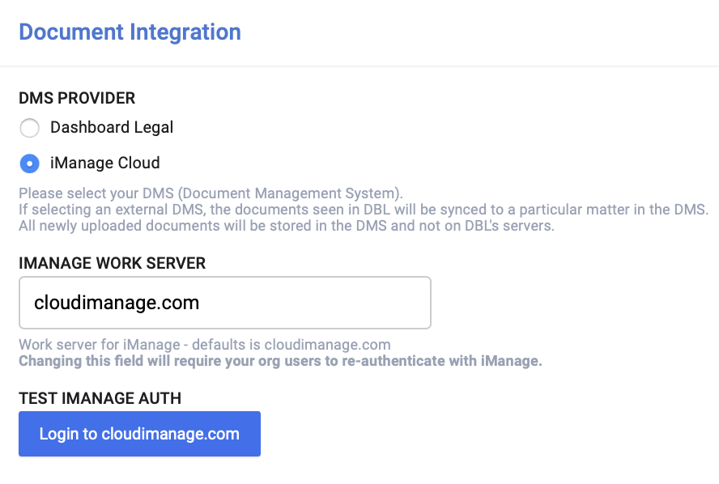

import {
  ExpansionPanel,
} from 'gatsby-theme-apollo-docs/src/components/expansion-panel';

## Admin setup of iManage integration

<ExpansionPanel title="Prerequisite: iManage Application Package">
In order to integrate Dashboard Legal with iManage, you will need a package provided to you by the Dashboard Legal team.

- If you are configuring an on-premise deployment, send your DBL representative the full url where Dashboard Legal is deployed.
- You will be returned a file titled "manifest.yaml.zip" which includes the package necessary for the integration.
- If you are configuring an on-premise deployment, use the "api_key" and "api_secret" in your rcspec configuration.
</ExpansionPanel>

1. Log into your iManage control center, and [upload an application package](https://docs.imanage.com/cc-help/10.3.3/en/Adding_an_application_package.html#src-103563194_id-.AddingAppsv10.3.3-Uploadingpackage) that was provided to you.
2. Enable the application for all of your users, and please set "Allow Refresh Token" to "Yes"
3. Go to DBL and use the account dropdown to go to *Organization Settings > Integrations*.
4. Under "Document Integration", select " iManage Cloud/On-Prem" and press "Save". 
5. Configure your iManage work server. This should look like "domain.com", without any "https://" or additional path
6. Press "Save" 
7. To confirm that everything is set up properly, test the iManage authentication with your own account.

## Integration Details
### Requirements
- iManage 10 or above (cloud or on-prem)
- iManage server needs to accept https requests from "44.198.145.110"

### API Endpoints
The following API endpoints are used, prefixed with "[BASE_URL]/work/api/v2/customers/[CUSTOMER_ID]/libraries/[LIBRARY_ID]"
- GET "/workspaces"
- GET "/workspaces/[MATTER_ID]"
- GET "/folders"
- GET "/folders/[FOLDER_ID]"
- GET "/documents"
- GET "/documents/[DOCUMENT_ID]"
- GET "/documents/[DOCUMENT_ID]/download"
- GET "/documents/[DOCUMENT_ID]/versions"
- POST "/workspaces/[MATTER_ID]/folders"
- POST "/folders/[FOLDER_ID]/subfolders"
- POST "/documents/[DOCUMENT_ID]/versions"
- POST "/folders/[FOLDER_ID]/documents"

## What happens next

The iManage integration will enable your organization users to log into iManage via their [account integrations settings](https://app.dashboardlegal.com/x/account/integrations/) page. The authentication is Oauth2-based, and after being redirected to iManage to enter their credentials, they will be able to view the same documents in Dashboard Legal as they would in the cloud iManage UI.

If a user has not linked their iManage account, they will not be able to see any documents in Dashboard Legal, but a message asking them to log in. The user should only have to log in once, but if they ever want to refresh their API token, or disconnect their iManage account, they may do so from their account integration page.

Please take a look at the [how to guide](./how-to/) for managing documents as a user or workstream admin.

## Things to note about administering the iManage integration
- iManage matters are mapped to Dashboard Legal Workstream boards. In the settings for the board, board admins will find a dropdown to select the iManage matter for that workstream.
- Once linked, that matter's documents will show up in the workstream board. An iManage matter can only be linked to one Dashboard Legal Workstream
- You can only set up one DMS integration at a time. If you go back to the [organization integration settings](https://app.dashboardlegal.com/x/settings/integrations/) and select "Dashboard Legal", the workstream documents will source from Dashboard Legal's DMS. Although it's possible to toggle between various DMS providers, we'd recommend not doing that.

