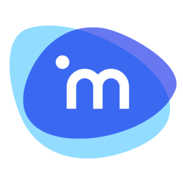
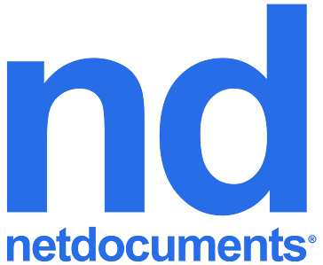

## How it works

Dashboard Legal allows for you to manage documents in the same place that you manage your external emails, internal chat, and checklist todo's.

If you use a supported Document Management System (DMS), you can quickly link workstream boards to matters in your DMS and documents will always be 2-way synced.

If you do not have a DMS, feel free to work on top of ours! It will work as expected without any extra configuration.

## Document Integrations

Dashboard Legal is designed to work side by side with your DMS, and can be integrated with one of several providers.

If your DMS provider is not currently supported but you can't wait to try out Dashboard Legal, please reach out to us and we will get you on board as quick as we can.

### Currently Supported Integrations

 **Dashboard Legal** (AWS s3)

 **iManage Cloud**

 **iManage On-Prem**

### Future Integrations

 **NetDocs Cloud**

## Document security

Dashboard Legal treats the security of your data & documents as it's highest priority. If you link a DMS, we do not store your documents, but transmit them securely from your DMS to the browser.

All DMS integrations are Oauth2-based, and make requests to your DMS on behalf of the currently logged-in user. This means that a user will only be able to see the documents that they have accessible in their DMS.

