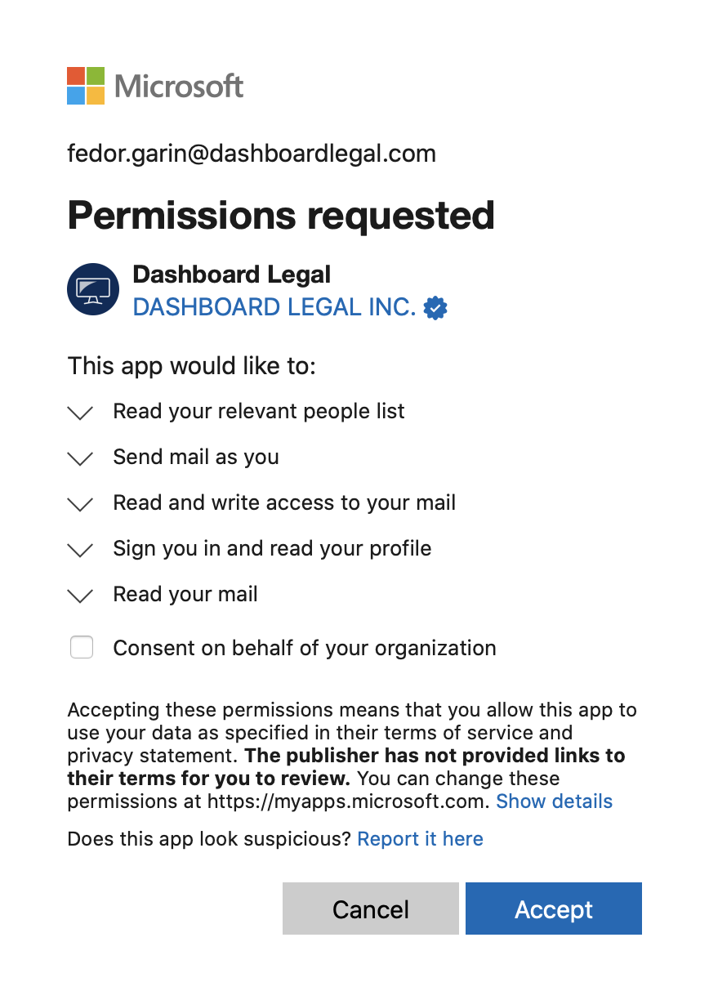
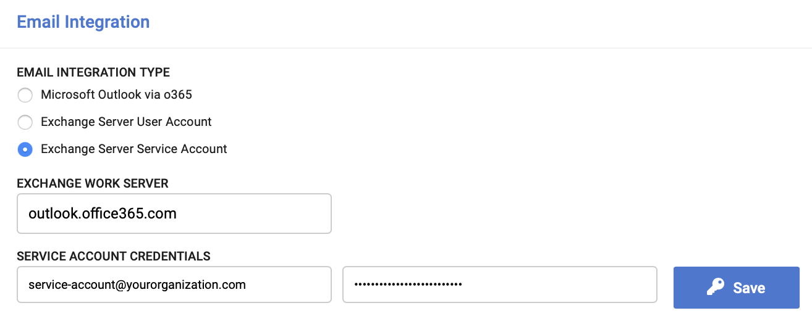
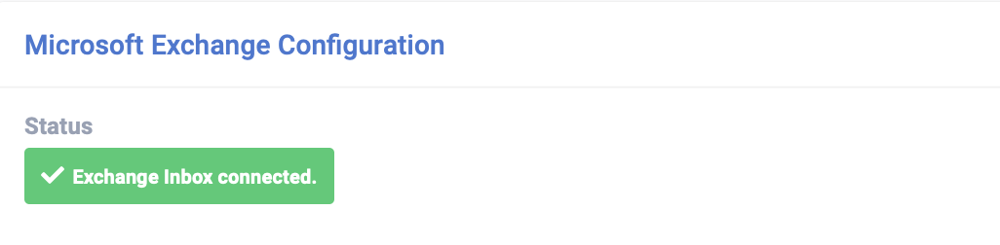
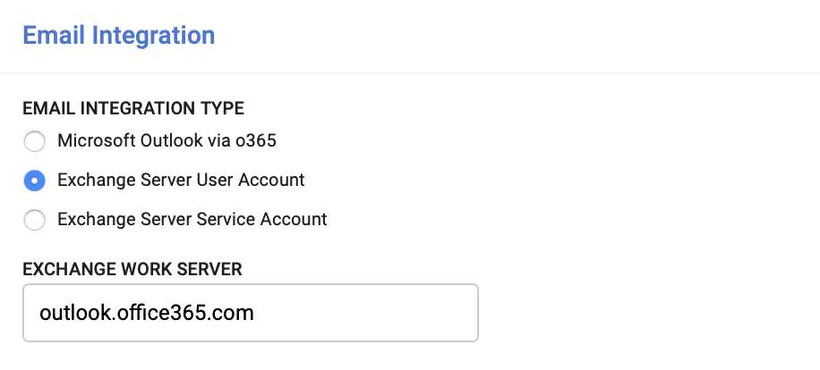
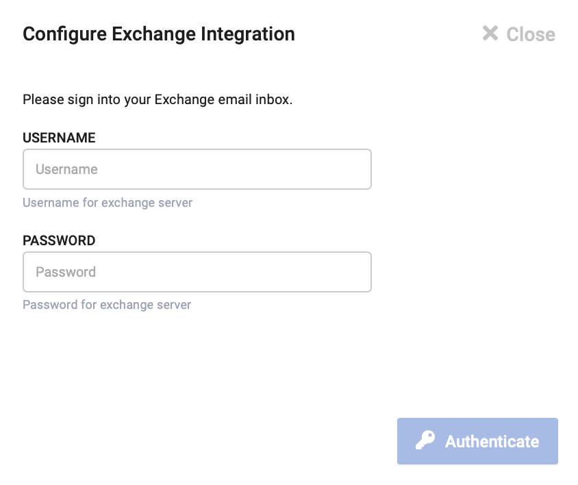

Dashboard Legal supports multiple providers for it's email functionality. All integration options follow the same principles of making authenticated requests to fetch & display emails from an external server. The functionality available to users is almost identical for each email integration, but the difference is in configuration and initial authentication.

## Outlook Integration via o365
Oauth2-based integration built on top of Microsoft's permissioning system. This integration can be used by o365 customers, as well as Exchange on-premises hybrid users.

### Configuration
This is the default integration option, and requires no additional configuration from the administrator.

### User Authentication
This is an Oauth2-based authentication flow, using Microsoft's secure API permission system that can be managed by both the end-user and IT administrator.

Users can go to their [email settings](https://app.dashboardlegal.com/x/account/email/) and press the blue button to get redirected to an Outlook login page. They will grant permission to Dashboard Legal to access required permissions on their behalf.

In the scenario where an administrator needs to approve access to use Dashboard Legal, please follow [this guide](../email/get-admin-approval/).

    

## Microsoft Exchange (Service Account)
This integration is for on-premise Exchange server 2016/2019. It requires a service account in Exchange that has access to all mailboxes that will be using Dashboard Legal. This integration option is available only with SAML SSO is also enabled on the organization.

### Configuration
The administrator of the organization performs the following:
- Configure [SAML SSO](../administration/security-settings/#single-sign-on) for the organization
- Create a service account in your Exchange Server, which has permissions to impersonate mailboxes of other users
- Choose the Exchange Service Account option in [Integration Settings](https://app.dashboardlegal.com/x/settings/integrations/)
- Configure the domain to the work server that hosts the Exchange server
- Save the credentials for the service account
- Test the integration on your own account in [email settings](https://app.dashboardlegal.com/x/account/email/)

### User Authentication
There is no requirement from end users once the administrator configures the service account. They just need to be logged in with SSO. In a user's [email settings](https://app.dashboardlegal.com/x/account/email/), if their inbox is accessible they will see a success message.

    

## Microsoft Exchange (User Credentials)
This integration is for on-premise Exchange server 2016/2019. As opposed to a single serivce account that can access all mailboxes, each user saves their own credentials to exchange in an encrypted credential storage.

This option is available for testing the Exchange integration on a few email accounts, but the Service Account option is preferrable for a quick onboarding experience.

### Configuration
Administrator selects this integration option and configures the exchange work server, then goes to their [email settings](https://app.dashboardlegal.com/x/account/email/) to link their own account.

    

### User Authentication
Users save the username + password for their Exchange account in an encrypted credential storage. The credentials are tested to confirm access to the mailbox, and the user will see either a success or error message.

    

