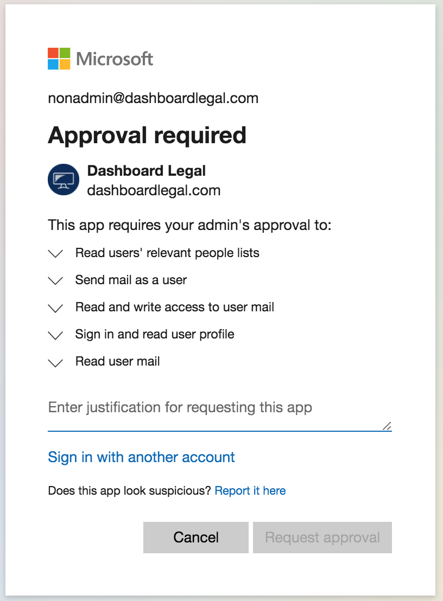
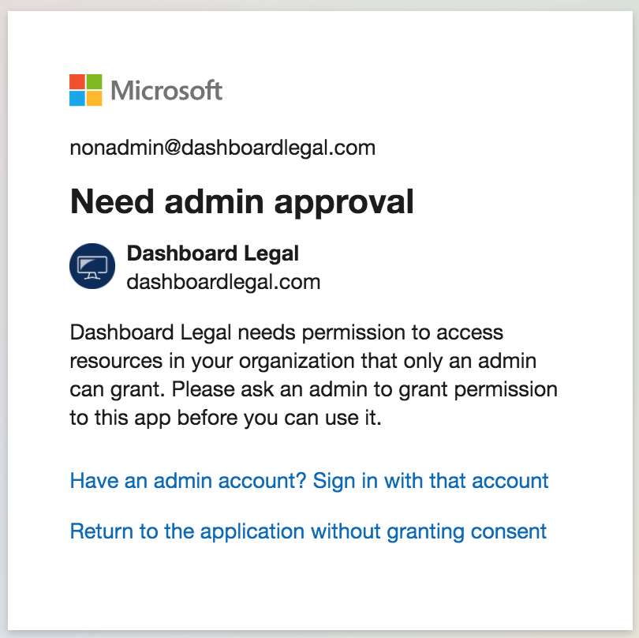

## Overview

Some Microsoft/Google accounts will require admin approval to use Dashboard Legal.

If you have followed the steps to [link your email](./link-your-email) and receive a permissions error, follow this guide to get the proper approval.

Each permission scenario also contains instructions for your organization admin to follow, which you can send to them to get up and running as soon as possible.

## Microsoft Outlook access request

### When you need it

When integrating your Outlook account, you may see a screen like the one below. This means that your Microsoft organization requires you to request permissions from an administrator in order to use Dashboard Legal. 

	

### To request access
1. Use the form to write a message to your admin, justifying your use of Dashboard Legal.
2. You will receive an email that the request is sent.
3. When your request is approved, you will receive an email notifying you.
4. You may then go to back to your [email settings](https://app.dashboardlegal.com/x/account/email/) to [link your email](./link-your-email) and your Outlook integration will be up and running.

### Granting access as an administrator
> If you are an organization administrator and are granting access to an employee to use Dashboard Legal, please read our [email security page](./email-security) and then follow the guide below.

1. Go to the [Admin Consents Review](https://portal.azure.com/#blade/Microsoft_AAD_IAM/StartboardApplicationsMenuBlade/AccessRequests/menuId/) page in the Azure Portal.
2. Click on the request to access Dashboard Legal.
3. You will see some information about Dashboard Legal, as well as the users in your organization that are requesting access to use it.
4. Click "Review permissions and consent" and you will be able to see the permissions that Dashboard Legal requires.
5. Click "Accept". This will approve the application the requesting user, as well as any future ones in your organization.
6. If you choose to restrict Dashboard Legal to just the user who requested access, you may do so by finding Dashboard Legal in [all applications](https://portal.azure.com/#blade/Microsoft_AAD_IAM/StartboardApplicationsMenuBlade/AllApps/menuId/), enabling "User assignment required" in the "Properties" page, and managing individual users/groups in the "Users and groups" page.

## Microsoft Outlook admin user required

### When you need it
If you see the below screen, that means that your Microsoft organization does not allow non-admins to use or request the use of third-party applications. Your organization does not use Microsoft's built-in features to request permissions, so we'll need to track down an administrator and have them sign up for Dashboard Legal.

	

### To request access
1. Find out who your Microsoft organization administrator is.
2. Go to your [organization settings](https://app.dashboardlegal.com/x/settings/users/) and invite them to use Dashboard Legal.
3. Reach out to them and have them [register](https://app.dashboardlegal.com/accounts/signup/), then [link their email](https://app.dashboardlegal.com/x/account/email/). They may have some questions about email security, please send them our [email security page](./email-security) and put them in touch with your Dashboard Legal representative if necessary.
4. They can then authorize Dashboard Legal for their account, and also grant access to the rest of the users in your Microsoft organization.
5. You may now both enjoy a streamlined email workflow together :)

### Granting access as an administrator
> If you are an organization administrator and are granting access to an employee to use Dashboard Legal, please read our [email security page](./email-security) and then follow the guide below.

1. Your colleague has invited you to join their Dashboard Legal organization. Please sign up at our [registration page](https://app.dashboardlegal.com/accounts/signup/) with the email that they have entered for you.
2. Go to your [email settings](https://app.dashboardlegal.com/x/account/email/) and click on the Outlook button to [link your email](./link-your-email)
3. You will be presented with the Microsoft permissions page which indicates which of Microsoft's APIs Dashboard Legal can use.
4. Check the box for "Consent on behalf of your organization" and press "Accept". This will now grant access to the rest of your users in your Microsoft organization.
5. If you choose to restrict Dashboard Legal to just the user who requested access, you may do so by finding Dashboard Legal in [all applications](https://portal.azure.com/#blade/Microsoft_AAD_IAM/StartboardApplicationsMenuBlade/AllApps/menuId/), enabling "User assignment required" in the "Properties" page, and managing individual users/groups in the "Users and groups" page.

