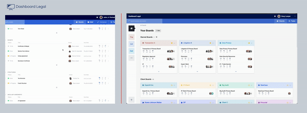
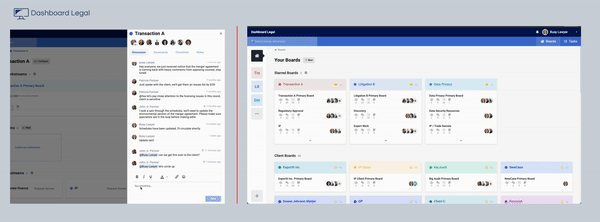
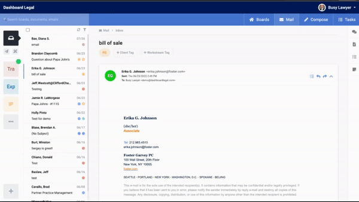
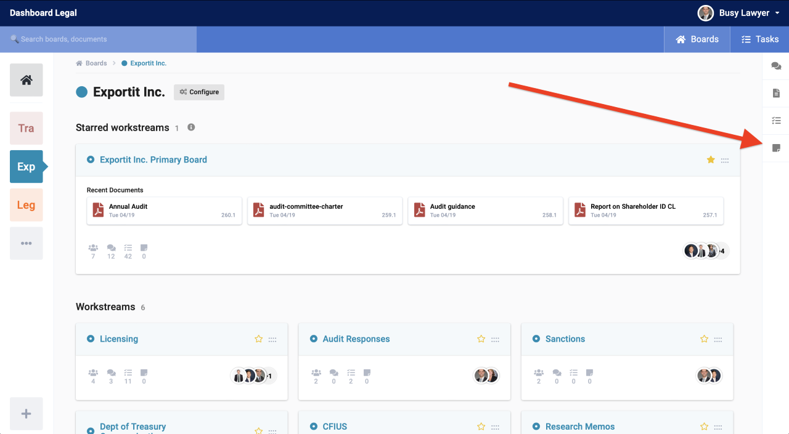
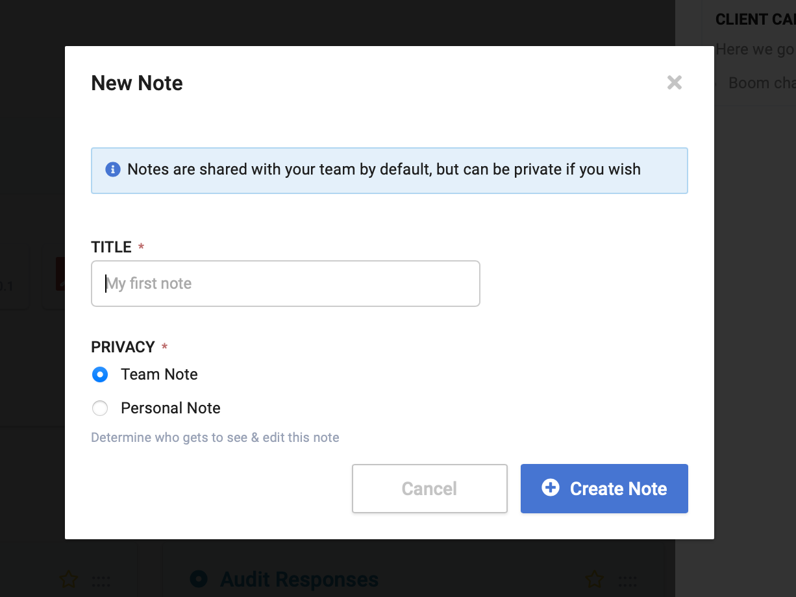
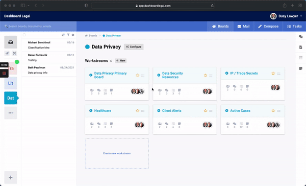
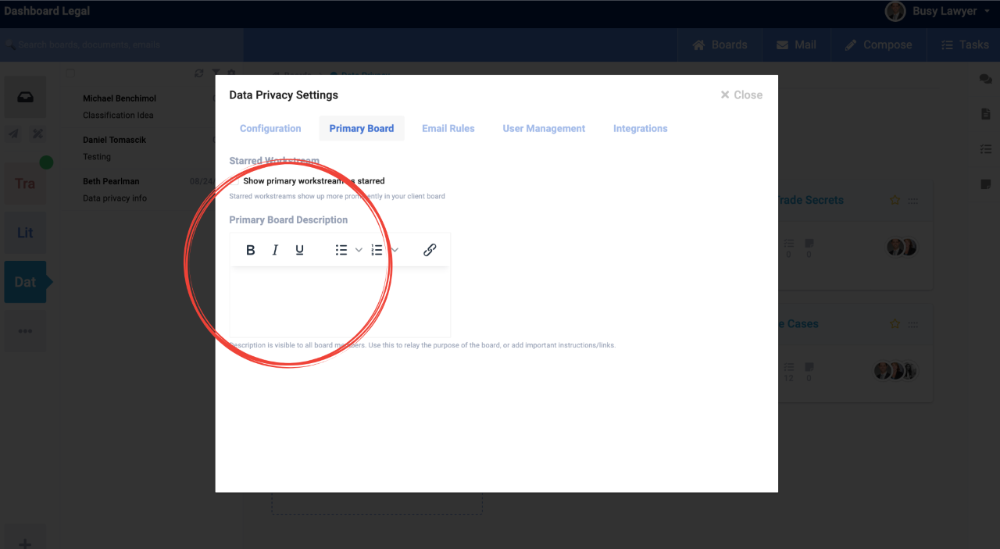

## Notifications

**You'll see a 🔔 icon next to your name (right hand corner), which is the notification center.**
 
Notifications are sent when you're
1. Added to a task 
2. Added to a board 
3. Mentioned in chat

*To mention a teammate in a chat, type "@" and start typing their name, then click on them or press enter*

**Added to a task:**

    

**Mentioned in chat:**

    

## Email push to task

You can push an email to a task item, or attach a document to an individual task. 
 
Here's how the email push works:

    

Instead of endlessly forwarding email chains, attach the email to a specific task for the whole team to see. 
 
**Better context for the group, better context for your future self. **
 
When selecting which task to attach the email, you can just start typing: 
1. the name of the checklist, or
2. the name of the primary board, or 
3. the name of the workstream board.

*And it will auto populate.*

## Notes

On the right side of each board (primary boards and workstream boards) you'll see a Notes icon. 

    

You'll have the option to create a Team Note or Private Note - Team notes can be viewed and edited by any member of the applicable board, private notes are just for you. 

    

Taking notes on a client call and want to reference it later? *Drop it in a Note.*
 
Responsible for action items after a team meeting? *Drop it in a Team Note*, so everyone can see what was discussed. 
 
Are you sending emails to yourself with follow-ups, random thoughts, other things you need to keep track of? Ditch that. *Create a note* in the applicable client or matter board, and have context to your Notes. 

## Board archiving
Press the "Configure" button in any Board (where you are the owner) and you'll see the "Archive Board" option. In your main Boards view you'll see archived boards, so you can always undo this later. 

    

**Add a Description to a Board** (for client contact info, or other material info) - available in the "Configure" window within any board you created. The description will then show under the title of the board. 

    

